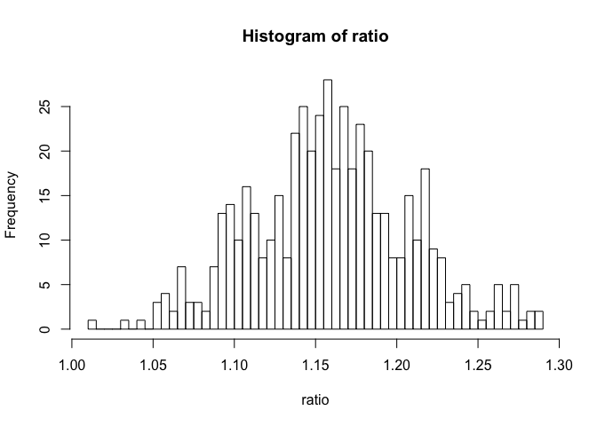
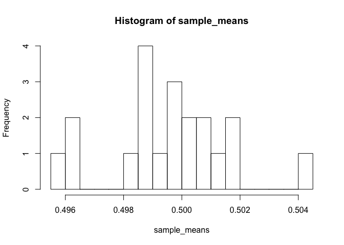

<table>
<tbody>
<tr class="odd">
<td>title: 2 Probability and stats</td>
</tr>
<tr class="even">
<td>output: md_document</td>
</tr>
</tbody>
</table>

**p. 20**: Simulation of ratio of probabilities

    # Simulation for men
    n_men <- 500
    p_hat_men <- .75
    se_men <- sqrt( p_hat_men * (1 - p_hat_men) / n_men)
    # Simulation for women
    n_women <- 500
    p_hat_women <- .65
    se_women <- sqrt( p_hat_women * (1 - p_hat_women) / n_women)
    # Combine for simulation of ratios
    n_sims <- 10000
    p_men <- rnorm(n_men, p_hat_men, se_men)
    p_women <- rnorm(n_women, p_hat_women, se_women)
    ratio <- p_men / p_women
    hist(ratio, 50)

    mu_ratio <- mean(ratio)
    int_95 <- quantile(ratio, c(.025, .975))
    mu_ratio

    ## [1] 1.15758

    int_95

    ##     2.5%    97.5% 
    ## 1.081332 1.243391

**p.27**: Question 3

    n_col <- 20
    n_row <- 10000
    raw_samples <- runif(n_row * n_col)
    dim(raw_samples) <- c(n_row, n_col)
    sample_means <- apply(raw_samples, MARGIN = 2, FUN = mean)
    hist(sample_means, 20)

