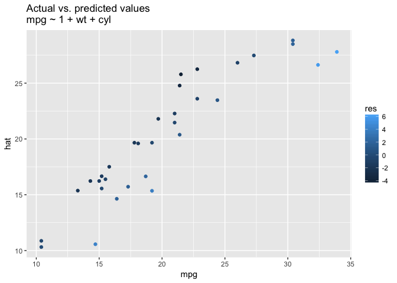
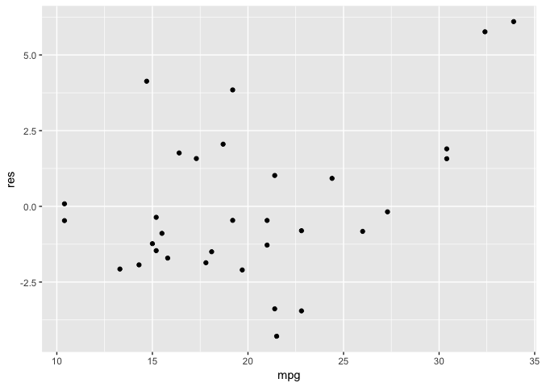

<table>
<tbody>
<tr class="odd">
<td>title: 2 Probability and stats</td>
</tr>
<tr class="even">
<td>output: md_document</td>
</tr>
</tbody>
</table>

    library(ggplot2)

3.2: Multivariate models
========================

-   Ideally, coeffs in a mutivariate linear model would tell us how much
    outcome varies when a predictor is varied, *keeping all other
    predictors fixed*.
-   This interpretation is not always possible because of collinearity
    of input data.
-   This is also often impractical if, for example, we want polynomial
    transformations: `y ~ 1 + x + x**2`

Counterfactual + predictive interpretations
-------------------------------------------

-   Nuances regarding the above definition: I think it goes...
-   **predictive interpretation**: What do we expect when we *observe*
    two individuals who are the the same except for difference in a
    single predictor?
-   **counterfactual interpretation**: What do we expect if we *modify*
    an individual's value for a certain predictor.
-   Counterfactual appears to have causality embedded in interpretation?

3.3: Interactions
=================

Variable encoing
----------------

-   Binary variables give different intercepts to different subgroups
-   Use interactions between binary and continuous predictors to give
    different slopes to different groups
-   As an example, consider IQ score comparisons between children and
    their mothers, with binary for mother completed HS:
    `y ~ 1 + mom_hs + mom_iq + mom_hs*mom_iq`
-   `mom_hs` gives the difference of intercepts
-   interaction terms gives the difference between slopes for kids whose
    mom went to HS versus not.

3.4: Inference
==============

-   Note the above model has 4 *predictors* (coefficients) but only 2
    *inputs*
-   Notation: `X_i*B = X_i1*B_1 + ... + X_ik*B_k`.
-   Notation: `y_i = X_i*B + e_i`
-   Alternatively: `y_i ~ N(X_i*B, \sigma**2)` where `\sigma**2` is that
    variance of the `e_i`.

Fitting models in R

    fit <- lm(mpg ~ 1 + cyl + wt, mtcars)
    summary(fit)

    ## 
    ## Call:
    ## lm(formula = mpg ~ 1 + cyl + wt, data = mtcars)
    ## 
    ## Residuals:
    ##     Min      1Q  Median      3Q     Max 
    ## -4.2893 -1.5512 -0.4684  1.5743  6.1004 
    ## 
    ## Coefficients:
    ##             Estimate Std. Error t value Pr(>|t|)    
    ## (Intercept)  39.6863     1.7150  23.141  < 2e-16 ***
    ## cyl          -1.5078     0.4147  -3.636 0.001064 ** 
    ## wt           -3.1910     0.7569  -4.216 0.000222 ***
    ## ---
    ## Signif. codes:  0 '***' 0.001 '**' 0.01 '*' 0.05 '.' 0.1 ' ' 1
    ## 
    ## Residual standard error: 2.568 on 29 degrees of freedom
    ## Multiple R-squared:  0.8302, Adjusted R-squared:  0.8185 
    ## F-statistic: 70.91 on 2 and 29 DF,  p-value: 6.809e-12

Plotting the actual vs predicted values. Are the errors correlated?

    # Compute rediduals
    outcomes <- data.frame(mpg=mtcars$mpg)
    outcomes$hat <- predict.lm(fit, mtcars)
    outcomes$res <- apply(outcomes, 1, function(x) {x["mpg"]-x["hat"]})
    # Plot residuals
    ggplot(outcomes, aes(x=mpg, y=hat, color=res)) +
        geom_point() +
        ggtitle("Actual vs. predicted values\nmpg ~ 1 + wt + cyl")

    # Do errors correlate to actual outcomes?
    sprintf("Cov(mpg, res) = %.3f", cor(outcomes$mpg, outcomes$res))

    ## [1] "Cov(mpg, res) = 0.412"

    ggplot(outcomes, aes(x=mpg, y=res)) + geom_point()

 This indicates
that the model is better at predicting for low mpg cars.

3.6
===

Model assumtions, in most to least relevant order: - Validity: mental
model. Will model be useful? Is sample representative? - Linearity: Are
transformations more appropriate? Consider multiplicative factors, etc.
- Independence of errors: Errors are uncorrelated - Equal variance of
errors? - Normality of errors
