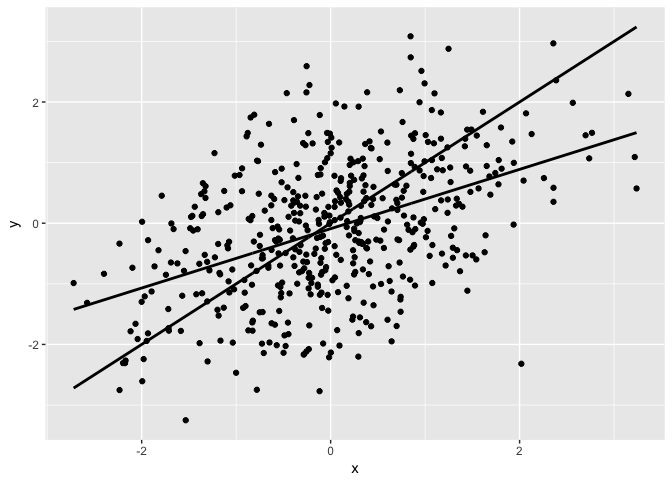

<table>
<tbody>
<tr class="odd">
<td>title: 4 Linear regression: Before and after fitting the model</td>
</tr>
<tr class="even">
<td>output: md_document</td>
</tr>
</tbody>
</table>

    library(ggplot2)

Transformations / vectorization
===============================

Most of the chapter is deicated to this: - Vectorize input data to make
model more interpretable - When predictors are shifted to from `var` to
`var-mean(var)`, intercepts give expected values accross the entire
population. - Scale variables so that the "how do things change when a
single predictor is modified" inprepretation is easy to read. Eg.
consider kilometers vs meters as units, etc. - (Not discussed in text)
Regression is scale-invariant when there is no regularization. Have to
be careful about scaling when using regularization, though it seems
regularization is more for predictive rather than interpretation
use-case. - Principal component line vs. regression line: PCA appears to
fit better at first glance. However, the PCA provides a biased estimate
of `E(y|x)`. It will underestimate low values and overestimate high
values.

    n_points <- 500
    df <- data.frame(x <- rnorm(n_points))
    df$y <- .5*x + rnorm(n_points)

    lm_fit <- lm(y ~ x, df)

    print(lm_fit)

    ## 
    ## Call:
    ## lm(formula = y ~ x, data = df)
    ## 
    ## Coefficients:
    ## (Intercept)            x  
    ##   -0.002553     0.539666

    df$pred <- predict.lm(lm_fit, df)

    ggplot() +
      geom_point(aes(x, y), df) +
      geom_line(aes(x, x), df, size=1) +
      geom_line(aes(x, pred), df, size=1)

 - How to
interpret models after log transformed output variables. - More on
transformations: - loglog transform of output. Is this useful? - square
root transformation -- maybe useful if predicting a squared quantity
like Euclidean distance? - Using continuous rather than discrete: The
book markets not replacing continuous variables with discrete ones
because of information loss around 'borderline' data. - However we can
create non-linear transformation by doing "ordered factor" transforms of
variables

Building models for prediction
==============================

General principals: - include everything you think might reasonably
contribute to outcome - consider combining predictors into "total
scores" rather than including individual ones. - Consider including
interactions for inputs which have large effects - Strategy for deciding
if a variable should be excluded: - if not statistically significant and
has expected sign, generally fine to keep. While not helping, probably
not hurting model fit. - if not significant and doesn't have expected
sign, consider removing. - If significant and has *unexpected* sign,
think hard about it. Perhaps there are interactions not being considered
involving this var. - if significant and expected sign, keep in in there
:)
